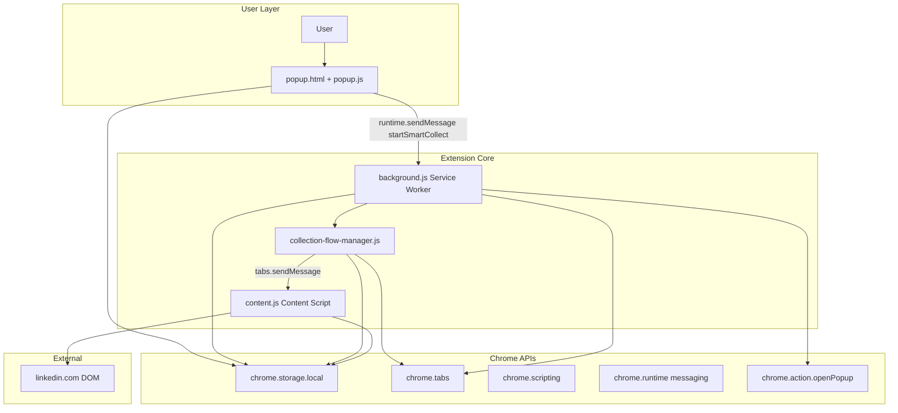
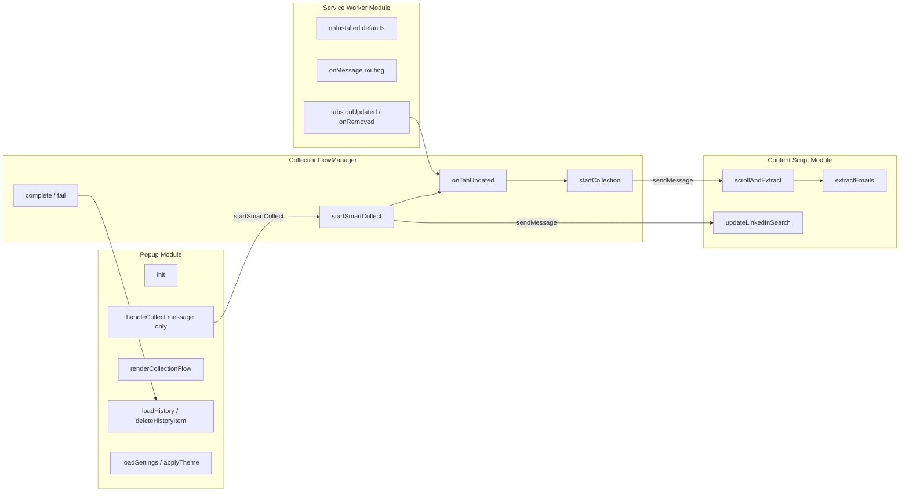
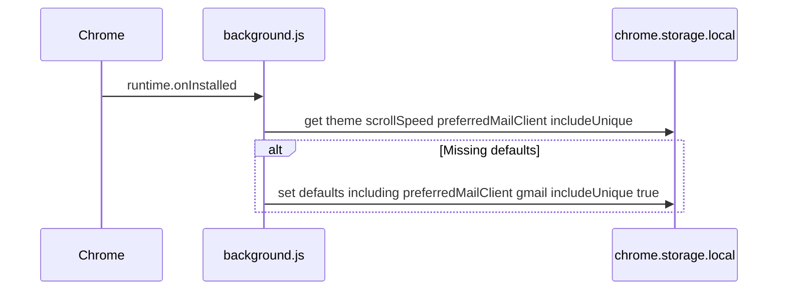
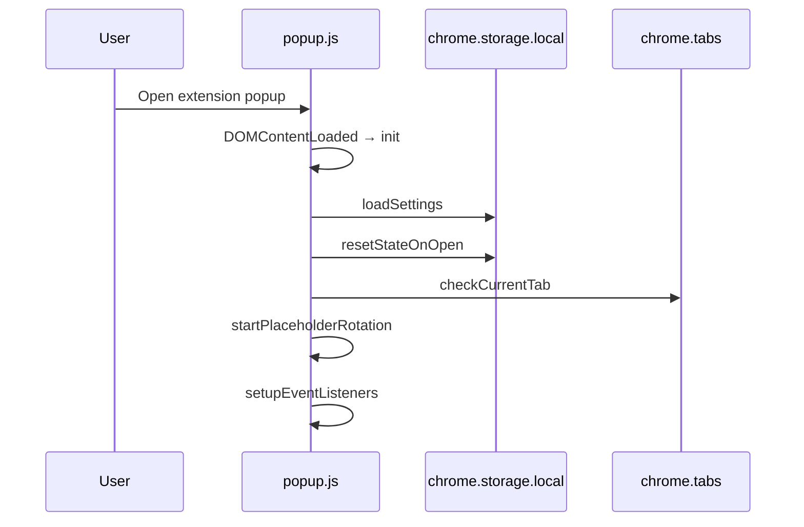
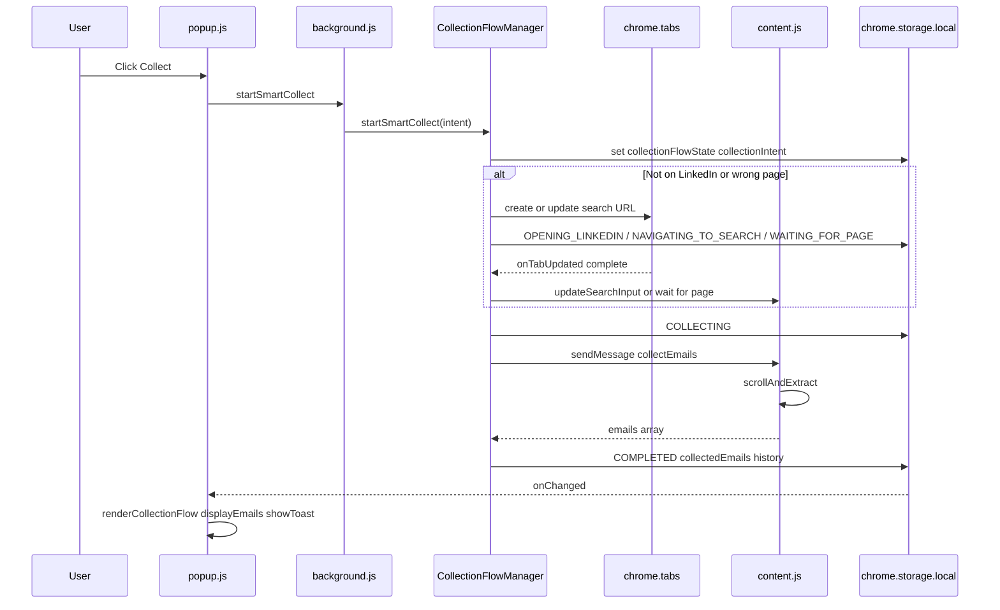
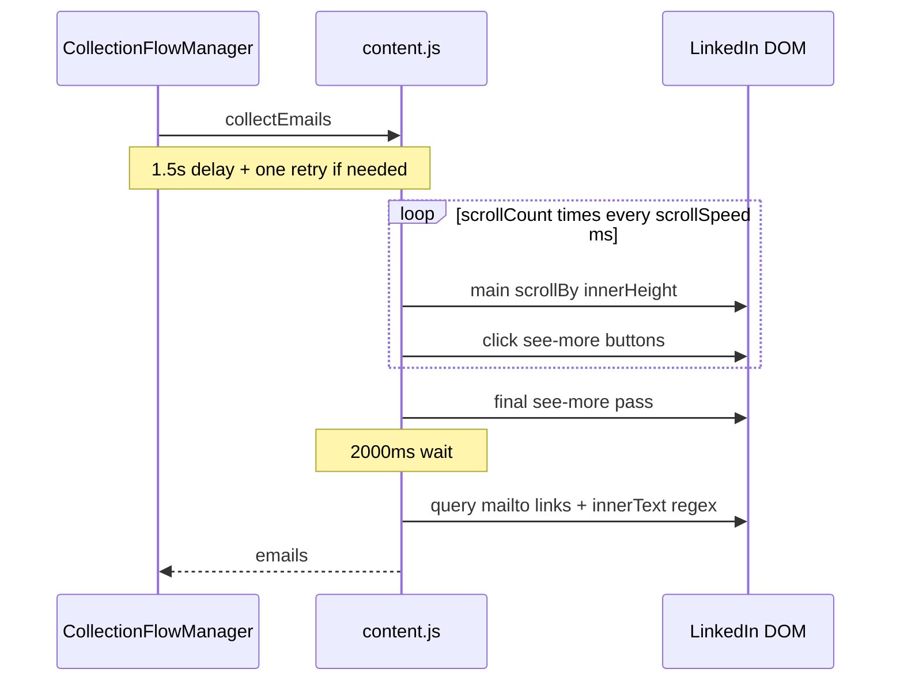
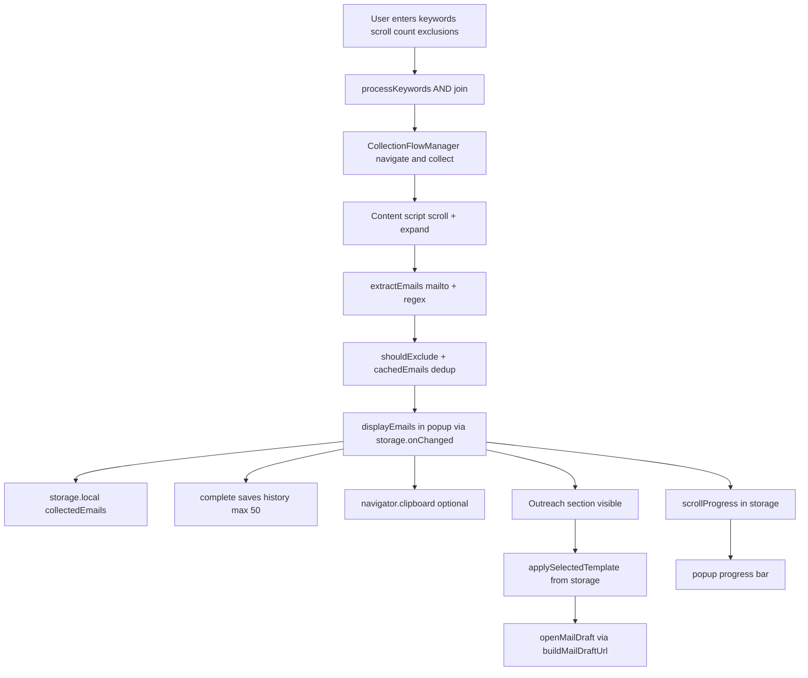
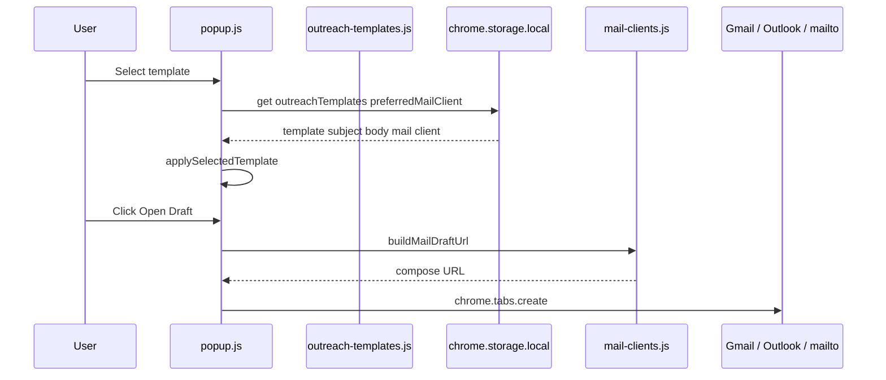

# ReachIn Architecture

Engineering reference for the ReachIn Chrome Extension (Manifest V3).

---

## Executive Summary

**ReachIn** is a Chrome Extension that collects publicly visible email addresses from LinkedIn content search result pages. All processing occurs locally in the browser; no external APIs, analytics, or remote servers are used.

### Core Features

- Keyword-based LinkedIn content search navigation
- Auto-scroll and "see more" expansion on search results
- Email extraction from `mailto:` links and page text
- Keyword-based email exclusion filtering
- Cross-session unique email deduplication (optional)
- Collection history with copy and delete
- Light, dark, and system themes
- Local storage via `chrome.storage.local`

### Extension Responsibilities

| Component | Responsibility |
|-----------|----------------|
| Popup (`popup.js`) | User interface, storage-driven flow display, history, settings |
| Content script (`content.js`) | LinkedIn DOM interaction, scrolling, expansion, email extraction |
| Service worker (`background.js`) | Install defaults, `CollectionFlowManager` orchestration, tab lifecycle |
| `collection-flow-manager.js` | Smart collect state machine, navigation, collection start, history save |
| Storage layer | Persist settings, flow state, session data, email cache, and history |

---

## High-Level Architecture



### Popup UI

Entry point: `manifest.json` → `action.default_popup` → `popup.html`.

The popup is the view layer. It reads/writes storage, sends `startSmartCollect` to the background, and renders flow progress from `collectionFlowState`. It does not touch the LinkedIn DOM directly or own navigation logic.

See [`UI_AND_UX.md`](UI_AND_UX.md) for view structure and user flows.

### Content Scripts

Registered in `manifest.json` for `https://www.linkedin.com/*`. Collection is triggered via `chrome.tabs.sendMessage` from `CollectionFlowManager` (no programmatic re-injection on the collection path).

Responsibilities: scroll page, click expand buttons, extract emails, update LinkedIn search input.

See [`CONTENT_SCRIPT.md`](CONTENT_SCRIPT.md) for DOM interaction details.

### Service Worker

Single file: `assets/js/background.js`. Loads `collection-utils.js` and `collection-flow-manager.js` via `importScripts`.

Responsibilities:
- Initialize default settings on install
- Handle `startSmartCollect` and `getCollectionFlow` messages
- Delegate tab events to `CollectionFlowManager`
- Best-effort popup reopen during active flow

### Chrome APIs

All Chrome API usage is local to the three JS modules. No network APIs are used. Full inventory in [`COVERAGE_REPORT.md`](COVERAGE_REPORT.md).

### Storage Layer

Single namespace: `chrome.storage.local`. Keys documented in [`STORAGE.md`](STORAGE.md).

### LinkedIn Interaction Layer

Content script operates exclusively on LinkedIn pages. Selectors and extraction logic are in `assets/js/content.js`. Navigation URL pattern:

```
https://www.linkedin.com/search/results/content/?keywords={processed}&origin=GLOBAL_SEARCH_HEADER&sortBy=date_posted
```

---

## Component Diagram



---

## Extension Lifecycle

### Installation



Triggered by `chrome.runtime.onInstalled` in `background.js:4-25`.

### Activation (Popup Open)



`resetStateOnOpen()` verifies the active collection tab still exists; resets state if closed.

### Collection Flow (Smart Collect)



Full scenario mapping in [`BUSINESS_LOGIC.md`](BUSINESS_LOGIC.md).

### Data Persistence

- **Settings**: Written on change; loaded on popup open
- **Flow state**: `collectionFlowState`, `collectionIntent`, `collectionError` during smart collect
- **Session state**: `collectedEmails`, `activeCollectionTabId`, `scrollProgress` during collection
- **History**: Appended in `CollectionFlowManager.complete()`; capped at 50 entries
- **Email cache**: Updated in content script when `includeUnique` is enabled

### History Management

`CollectionFlowManager.complete()` prepends a new history entry with `id`, `date`, `keywords`, `emails`, and `count`. Entries beyond 50 are truncated. Individual entries can be deleted from the History view in popup.

---

## Message Passing Architecture

### Overview

ReachIn uses two messaging channels:

1. **Popup → Background** via `chrome.runtime.sendMessage` (smart collect orchestration)
2. **Background → Content** via `chrome.tabs.sendMessage` (collection and search update)

The content script listens via `chrome.runtime.onMessage`. The background listens via `chrome.runtime.onMessage`.

### Message Registry

| Action | Sender | Receiver | Async | Payload | Response |
|--------|--------|----------|-------|---------|----------|
| `startSmartCollect` | popup | background | Yes | `{ keywords, scrollCount, excludeKeywords, includeUnique }` | `{ success, error? }` |
| `getCollectionFlow` | popup | background | Yes | — | flow state snapshot |
| `collectEmails` | background | content | Yes (`return true`) | `{ scrollCount, scrollSpeed, excludeKeywords, includeUnique }` | `{ emails: string[] }` |
| `updateSearchInput` | background | content | Yes | `{ keywords: string }` | `{ success: boolean }` |
| `clearCache` | — | content | No | — | `{ success: true }` (unused) |
| `openPopupOnTabReady` | popup | background | Yes | `{ tabId: number }` | `{ success: true }` (legacy) |
| `updateState` | — | background | Yes | `{ data: object }` | `{ success: true }` (unused) |
| `getState` | — | background | Yes | `{ keys?: string[] }` | storage data (unused) |

### Collection Sequence Diagram



### Content Script Injection

The content script is injected via manifest registration on every LinkedIn page load. The IIFE guard prevents double initialization:

```javascript
if (window.__linkedinEmailCollectorInitialized) {
  return;
}
window.__linkedinEmailCollectorInitialized = true;
```

---

## Data Flow



### Outreach Flow (Popup Only)

Outreach is implemented entirely in the popup. No content script or service worker involvement.



Mail compose URL formats (`assets/js/mail-clients.js`):

| Client | URL pattern |
|--------|-------------|
| Gmail | `https://mail.google.com/mail/?view=cm&bcc=&su=&body=` |
| Outlook | `https://outlook.office.com/mail/deeplink/compose?bcc=&subject=&body=` |
| mailto | `mailto:?bcc=&subject=&body=` |

All parameters are `encodeURIComponent`-encoded. No Gmail API, OAuth, or external servers.

---

## Module Breakdown

### `assets/js/popup.js`

**Purpose:** Popup UI controller (view layer).

**Dependencies:** `popup.html` DOM, Chrome storage/runtime APIs, `collection-utils.js`, `navigator.clipboard`.

**Consumers:** User via popup UI.

**Public interfaces:** None exported; all functions are internal to the `DOMContentLoaded` closure.

| Function | Purpose |
|----------|---------|
| `init()` | Bootstrap popup on open |
| `resetStateOnOpen()` | Validate/clean collection state |
| `loadSettings()` / `applyTheme()` | Settings and theme |
| `loadState()` | Restore form fields and results |
| `checkCurrentTab()` | Detect active tab URL |
| `handleCollect()` | Validate keywords; send `startSmartCollect` |
| `renderCollectionFlow()` | Update button, stepper, status from storage |
| `handleCopy()` | Clipboard copy |
| `applySelectedTemplate()` | Auto-fill subject/body on template change |
| `openMailDraft()` | Open compose draft via `buildMailDraftUrl()` |
| `showToast()` | Transient action feedback (via `ui/toast.js`) |
| `saveOutreachEdits()` | Persist outreach field edits |
| `loadOutreachTemplatesAndRefreshUI()` | Load templates; refresh dropdowns |
| `saveTemplate()` / `addNewTemplate()` / `deleteTemplate()` / `resetTemplateToDefault()` | Settings template CRUD |
| `updateScrollProgress()` / `showScrollProgress()` / `hideScrollProgress()` | Collection progress UI |
| `hideResults()` | Hide results and outreach panels |
| `loadHistory()` / `deleteHistoryItem()` | History CRUD |
| `switchView()` | Main / History / Settings navigation |
| `displayEmails()` / `updateStatus()` | UI updates |

### `assets/js/collection-utils.js`

**Purpose:** Shared keyword/URL helpers and `COLLECTION_FLOW_STATE` constants.

**Consumers:** `popup.js`, `collection-flow-manager.js`.

### `assets/js/collection-flow-manager.js`

**Purpose:** Background collection orchestrator (state machine, navigation, `startCollection`, `complete`, `fail`, history save).

**Consumers:** `background.js` via `importScripts`.

### `assets/js/ui/icons.js`

**Purpose:** Centralized SVG icon library (Lucide-style stroke icons).

**Exports:** `Icons`, `renderIcon()`, `createIconButton()`, `setButtonIcon()`, `flashButtonSuccess()`.

### `assets/js/ui/toast.js`

**Purpose:** Toast notification system.

**Exports:** `showToast(message, type)`.

### `assets/js/mail-clients.js`

**Purpose:** Mail client URL builders for compose drafts.

**Exports:** `MAIL_CLIENTS`, `buildMailDraftUrl()`, `getMailClientDraftLabel()`.

### `assets/js/outreach-templates.js`

**Purpose:** Default outreach template seed data.

**Consumers:** `background.js` (install seed), `popup.js` (reset to default).

**Public interfaces:** Top-level `DEFAULT_OUTREACH_TEMPLATES` array.

Runtime templates are stored in `chrome.storage.local` → `outreachTemplates`.

### `assets/js/content.js`

**Purpose:** LinkedIn page interaction and email extraction.

**Dependencies:** Chrome storage/runtime APIs, LinkedIn DOM.

**Consumers:** Popup via `chrome.tabs.sendMessage`.

**Public interfaces:** Message actions `collectEmails`, `updateSearchInput`, `clearCache`.

| Function | Purpose |
|----------|---------|
| `updateLinkedInSearch()` | Set LinkedIn search input and submit |
| `scrollAndExtract()` | Scroll loop with see-more clicks |
| `finishExtraction()` | Final expand pass + extract callback |
| `extractEmails()` | mailto + regex extraction, dedup, sort |
| `isValidEmail()` | Basic regex validation |
| `shouldExclude()` | Keyword substring exclusion |

### `assets/js/background.js`

**Purpose:** Service worker for lifecycle and tab event handling.

**Dependencies:** Chrome storage/tabs/action/runtime APIs.

**Consumers:** Popup via `chrome.runtime.sendMessage`; `CollectionFlowManager` via `importScripts`; Chrome via lifecycle events.

**Public interfaces:** Message actions `startSmartCollect`, `getCollectionFlow`, `openPopupOnTabReady`, `updateState`, `getState`.

| Listener | Purpose |
|----------|---------|
| `runtime.onInstalled` | Default settings |
| `runtime.onMessage` | Smart collect and popup messages |
| `tabs.onUpdated` | Delegated to `CollectionFlowManager` |
| `tabs.onRemoved` | Flow cleanup on tab close |
| `storage.onChanged` | Log collection state changes |

---

## Related Documentation

- [Project Structure](PROJECT_STRUCTURE.md)
- [Storage Design](STORAGE.md)
- [Content Script](CONTENT_SCRIPT.md)
- [Business Logic](BUSINESS_LOGIC.md)
- [Manifest Reference](MANIFEST.md)
