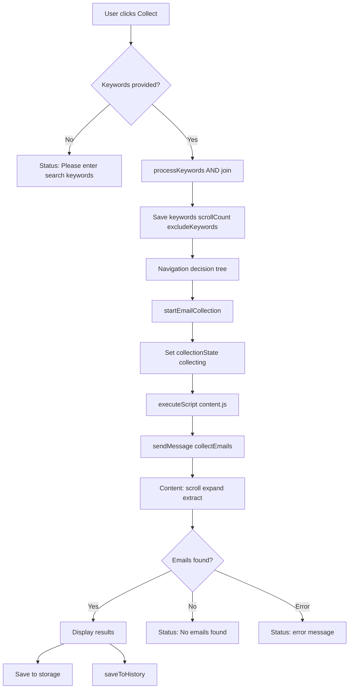
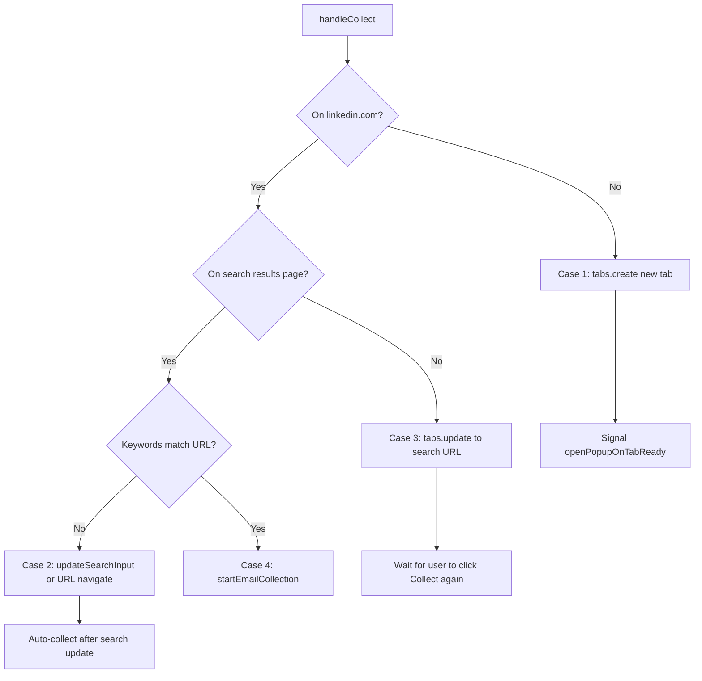
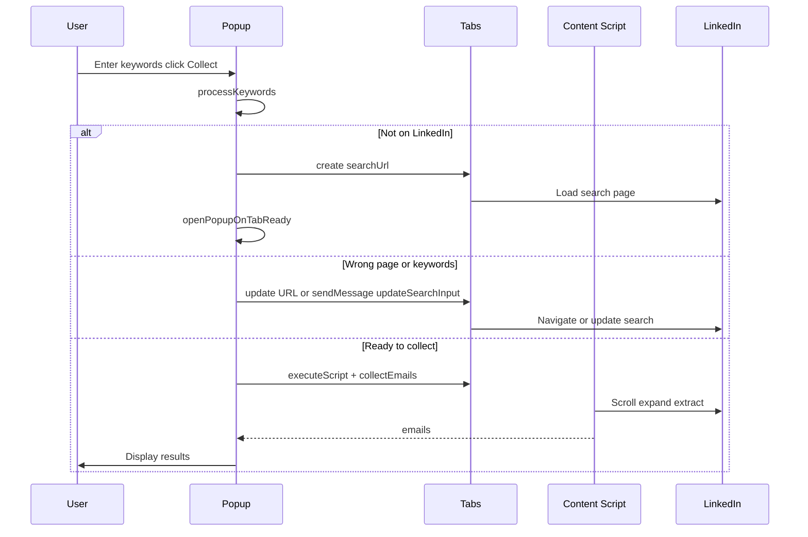

# ReachIn Business Logic

Reference for collection rules, filtering, deduplication, and user decision flows.

---

## Email Collection Workflow

End-to-end flow from user action to stored results:



---

## Keyword Processing

Function: `processKeywords(input)` in `popup.js:280-289`

**Input:** Comma-separated string (e.g., `"python, mumbai, hiring"`)

**Processing:**
1. Split by comma
2. Trim whitespace
3. Filter empty strings
4. Wrap each keyword in double quotes
5. Join with `" AND "`

**Output:** `"python" AND "mumbai" AND "hiring"`

**Example:**

| Input | Output |
|-------|--------|
| `python, mumbai` | `"python" AND "mumbai"` |
| `  react , frontend  ` | `"react" AND "frontend"` |
| `` (empty) | `""` (triggers validation error) |

Processed keywords are URL-encoded into the search URL:

```
https://www.linkedin.com/search/results/content/?keywords=%22python%22%20AND%20%22mumbai%22&origin=GLOBAL_SEARCH_HEADER&sortBy=date_posted
```

### Keyword Matching

When on an existing search page, popup compares current URL keywords with processed keywords via `getCurrentSearchKeywords()`:

```291:299:assets/js/popup.js
  function getCurrentSearchKeywords(url) {
    try {
      const urlObj = new URL(url);
      const keywords = urlObj.searchParams.get("keywords");
      return keywords ? decodeURIComponent(keywords) : "";
    } catch (e) {
      return "";
    }
  }
```

Exact string match determines if re-navigation is needed.

---

## Navigation Decision Tree

Function: `handleCollect()` in `popup.js:312-514`



### Case 1: Not on LinkedIn

**Condition:** `!url.includes("linkedin.com")`

**Action (autoNavigate enabled):**
- `chrome.tabs.create({ url: searchUrl, active: true })`
- Send `openPopupOnTabReady` to background
- Status: "Opening LinkedIn in new tab..."

**Action (autoNavigate disabled):**
- Status: "Please navigate to LinkedIn manually."

Background service worker attempts to auto-open popup when new tab finishes loading.

### Case 2: On Search Page, Keywords Don't Match

**Condition:** `isOnLinkedInSearch && !keywordsMatch`

**Action (autoNavigate enabled):**
1. Try `updateSearchInput` message to content script
2. If failed → fallback to `chrome.tabs.update` with new search URL
3. If succeeded → wait for page update, then auto-start collection

**Action (autoNavigate disabled):**
- Status: "Please navigate to new search manually."

### Case 3: On LinkedIn, Not on Search Page

**Condition:** `!isOnLinkedInSearch`

**Action (autoNavigate enabled):**
- `chrome.tabs.update({ url: searchUrl })`
- Wait for page load
- Status: "Search page loaded. Click 'Collect Emails' to start."

User must click Collect again after navigation.

### Case 4: On Correct Search Page

**Condition:** `isOnLinkedInSearch && keywordsMatch`

**Action:** `startEmailCollection(tabId, scrollCount, excludeKeywords)`

Immediate collection start.

---

## Filtering Rules

### Exclusion Logic

Function: `shouldExclude(email, excludeKeywords)` in `content.js:246-255`

**Input:** Lowercase email string, array of exclude keyword strings

**Rule:** Email is excluded if it **contains** any non-empty trimmed keyword as a substring.

```javascript
return excludeKeywords.some((keyword) => {
  const trimmedKeyword = keyword.trim();
  return trimmedKeyword && email.includes(trimmedKeyword);
});
```

**Examples:**

| Email | Exclude Keywords | Result |
|-------|-----------------|--------|
| `john@gmail.com` | `gmail.com` | Excluded |
| `john@company.com` | `competitor.com` | Included |
| `john@gmail.com` | `` (empty) | Included |
| `john@gmail.com` | `john, gmail` | Excluded (matches `gmail`) |

Exclude keywords are parsed in popup before sending to content script:

```551:554:assets/js/popup.js
                excludeKeywords: excludeKeywords
                  .split(",")
                  .map((k) => k.trim())
                  .filter(Boolean),
```

### Validation Logic

Function: `isValidEmail(email)` in `content.js:241-244`

```javascript
return /^[^\s@]+@[^\s@]+\.[^\s@]+$/.test(email);
```

Basic format check: local@domain.tld. Does not validate domain existence or RFC 5322 compliance.

---

## Deduplication Logic

Two levels of deduplication:

### Level 1: Within-Page Dedup

Uses JavaScript `Set` in `extractEmails()`. Same email found via mailto link and text regex appears once.

### Level 2: Cross-Session Dedup (Optional)

Controlled by `#includeUnique` checkbox in Settings → Collection (default: checked, persisted).

When enabled:
1. Content script loads `cachedEmails` from storage on init
2. After extraction, filters out emails already in cache
3. Adds newly found emails to in-memory `Set`
4. Persists updated cache to `chrome.storage.local`

```228:235:assets/js/content.js
    let resultEmails = [...foundEmails];
    if (includeUnique) {
      resultEmails = resultEmails.filter((email) => !cachedEmails.has(email));

      resultEmails.forEach((email) => cachedEmails.add(email));
    }
```

When disabled, all found emails on the page are returned regardless of cache.

**Note:** `includeUnique` is persisted in Settings → Collection (`chrome.storage.local`).

---

## Mail Draft Logic (Phase 1.5)

Function: `openMailDraft()` in `popup.js` → `buildMailDraftUrl()` in `mail-clients.js`.

**Inputs:** `preferredMailClient` from storage, collected emails as BCC, subject and body from outreach fields.

**Validation:** Requires collected emails and non-empty subject/body.

**Output:** `chrome.tabs.create({ url })` — no external APIs.

### Dirty-State Template Saving

Settings template editor tracks baseline on load/select. Save button enables only when name, subject, or body differ from baseline. Success shows toast and resets baseline.

---

## History Logic

### Save

Function: `saveToHistory(keywords, emails)` in `popup.js:615-634`

Triggered after successful collection (emails found).

**Entry structure:**
```javascript
{
  id: Date.now(),
  date: new Date().toISOString(),
  keywords: keywords,    // raw input, not processed
  emails: emails,
  count: emails.length
}
```

**Retention:** Prepended to array. Maximum 50 entries. Oldest removed via `history.splice(50)`.

### Load

Function: `loadHistory()` — reads all entries, renders chronologically (newest first).

### Delete

Function: `deleteHistoryItem(id)` — filters out entry by `id`, saves updated array.

No edit functionality. No export to file (clipboard only).

---

## Search Workflow

Complete search-to-results workflow:



---

## User Decision Flows

### Auto-Navigate Setting

| Setting | User Experience |
|---------|----------------|
| Enabled (default) | Extension navigates automatically; minimal manual steps |
| Disabled | User must manually open LinkedIn and navigate to search |

### Unique Emails Setting

| Setting | User Experience |
|---------|----------------|
| Enabled (default) | Only new emails (not seen in prior collections) returned; preference persisted |
| Disabled | All visible emails on page returned, including repeats |

### Clear All Data

User confirms → all storage cleared → settings reset to empty → must reconfigure theme/preferences.

---

## Sort Order

Extracted emails are sorted alphabetically before return:

```238:238:assets/js/content.js
    return resultEmails.sort();
```

---

## Related Documentation

- [Content Script](CONTENT_SCRIPT.md)
- [Storage Design](STORAGE.md)
- [UI and UX](UI_AND_UX.md)
