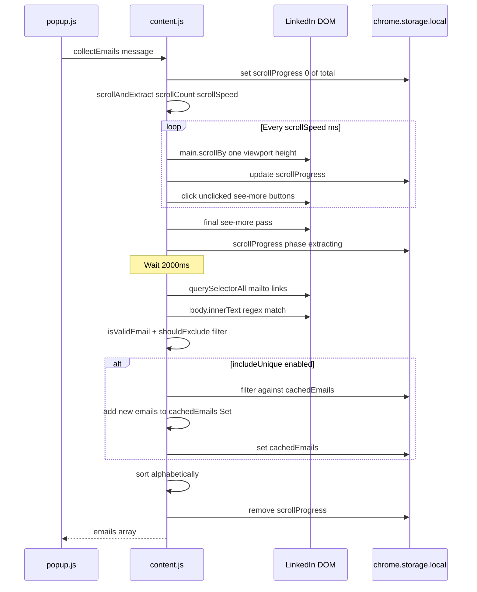

# ReachIn Content Script

Reference for [`assets/js/content.js`](../assets/js/content.js) — LinkedIn DOM interaction and email extraction.

---

## Overview

The content script runs in an isolated JavaScript world on LinkedIn pages. It shares the DOM with the page but cannot access page JavaScript variables. Communication with the popup uses `chrome.runtime.onMessage`.

**Injection methods:**
1. Manifest auto-inject on `https://www.linkedin.com/*`
2. Programmatic re-inject via `chrome.scripting.executeScript` during collection

**Initialization guard:**

```4:7:assets/js/content.js
  if (window.__linkedinEmailCollectorInitialized) {
    return;
  }
  window.__linkedinEmailCollectorInitialized = true;
```

---

## LinkedIn DOM Analysis

ReachIn interacts with these LinkedIn DOM elements:

### Search Input

| Selector | Element | Purpose |
|----------|---------|---------|
| `.search-global-typeahead__input` | Global search text input | Set keywords and trigger search |
| `.search-global-typeahead__overlay` | Search suggestions overlay | Hidden after search submission |

Used by `updateLinkedInSearch()` when popup detects keyword mismatch on an existing search page.

### Content Expansion

| Selector | Element | Purpose |
|----------|---------|---------|
| `button.see-more` | "See more" buttons | Expand truncated post text |
| `button[aria-label*="see more"]` | Aria-labeled expand buttons | Fallback selector |
| `button[aria-label*="Show more"]` | Aria-labeled expand buttons | Case-variant fallback |

Buttons are marked with `data-clicked="true"` after clicking to prevent duplicate clicks.

### Email Sources

| Source | Method | Purpose |
|--------|--------|---------|
| `a[href^="mailto:"]` | DOM query | Extract from mailto links |
| `document.body.innerText` | Full page text + regex | Extract from visible text |

---

## Email Extraction Workflow



---

## Scrolling Logic

Function: `scrollAndExtract(scrollCount, scrollSpeed, excludeKeywords, includeUnique, callback)`

| Parameter | Source | Default | Description |
|-----------|--------|---------|-------------|
| `scrollCount` | Popup input `#scrollCount` | 20 | Number of scroll iterations |
| `scrollSpeed` | Settings `scrollSpeed` | 2000ms | Interval between scrolls |
| `excludeKeywords` | Popup input, comma-split | `[]` | Substrings to exclude |
| `#includeUnique` | Checkbox in Settings → Collection | checked | Cross-session dedup |

Each iteration:
1. Scroll the LinkedIn feed via `document.querySelector("main")` (falls back to `document.documentElement`) by one viewport height
2. Click all unclicked "see more" buttons
3. Increment counter

LinkedIn content search uses an inner scroll container (`<main>`), not `window`. `window.scrollBy` does not move the feed on current LinkedIn layouts.

Total scroll duration: `scrollCount × scrollSpeed` milliseconds (e.g., 20 × 2000ms = 40 seconds).

Progress is written to `scrollProgress` in storage after each scroll and during the extraction phase (`phase: "extracting"`). Cleared when extraction completes.

After the loop completes, `finishExtraction()` runs.

---

## Expansion Logic

"See more" buttons are clicked during scrolling and in a final pass before extraction.

**Dedup mechanism:** `data-clicked="true"` attribute set after each click.

```138:155:assets/js/content.js
      document
        .querySelectorAll('button.see-more:not([data-clicked="true"])')
        .forEach((button) => {
          button.click();
          button.setAttribute("data-clicked", "true");
        });

      document
        .querySelectorAll(
          'button[aria-label*="see more"], button[aria-label*="Show more"]'
        )
        .forEach((button) => {
          if (!button.getAttribute("data-clicked")) {
            button.click();
            button.setAttribute("data-clicked", "true");
          }
        });
```

**Post-expansion wait:** 2000ms delay in `finishExtraction()` before email extraction to allow DOM updates.

---

## Selector Strategy

ReachIn uses **class-based and aria-label-based selectors** without centralization. Selectors are inline in query functions.

| Risk | Mitigation |
|------|------------|
| LinkedIn DOM changes break selectors | Monitor for empty results; update selectors in `content.js` |
| Multiple selector variants | Three expand button selectors provide fallback |
| No selector versioning | Document changes in commit messages |

**Recommended pattern for updates:** When LinkedIn changes DOM, update selectors in `content.js` only. Test on live LinkedIn search results page.

---

## Data Collection Workflow

### Step 1: Message Received

```24:32:assets/js/content.js
    if (request.action === "collectEmails") {
      scrollAndExtract(
        request.scrollCount,
        request.scrollSpeed || 2000,
        request.excludeKeywords,
        request.includeUnique,
        sendResponse
      );
      return true; // Indicates we will respond asynchronously
```

`return true` keeps the message channel open for async response.

### Step 2: Scroll and Expand

See scrolling and expansion sections above.

### Step 3: Extract Emails

Function: `extractEmails(excludeKeywords, includeUnique)`

**From mailto links:**

```202:211:assets/js/content.js
    document.querySelectorAll('a[href^="mailto:"]').forEach((link) => {
      const email = link
        .getAttribute("href")
        .replace(/^mailto:/, "")
        .split("?")[0]
        .toLowerCase();
      if (isValidEmail(email) && !shouldExclude(email, excludeKeywords)) {
        foundEmails.add(email);
      }
    });
```

**From page text:**

```214:226:assets/js/content.js
    const allText = document.body.innerText;
    const emailRegex = /\b[A-Za-z0-9._%+-]+@[A-Za-z0-9.-]+\.[A-Z|a-z]{2,}\b/g;
    const matchedEmails = allText.match(emailRegex) || [];

    matchedEmails.forEach((email) => {
      const lowerEmail = email.toLowerCase();
      if (
        isValidEmail(lowerEmail) &&
        !shouldExclude(lowerEmail, excludeKeywords)
      ) {
        foundEmails.add(lowerEmail);
      }
    });
```

**Validation:** `/^[^\s@]+@[^\s@]+\.[^\s@]+$/`

**Exclusion:** Case-insensitive substring match against each exclude keyword.

**Deduplication:** In-page dedup via `Set`. Cross-session dedup via `cachedEmails` when `includeUnique` is true.

**Output:** Alphabetically sorted array.

### Step 4: Respond

```194:194:assets/js/content.js
      callback({ emails: emails });
```

---

## Search Input Update

Function: `updateLinkedInSearch(keywords)`

Triggered by popup when on LinkedIn search page with non-matching keywords.

**Flow:**
1. Find `.search-global-typeahead__input`
2. Clear value, focus, set new keywords
3. Dispatch `input` event
4. After 300ms: dispatch Enter keydown/keyup events
5. Submit parent form if present
6. After 200ms: blur input, hide overlay, click body to close dropdown

Returns `true` on success, `false` if search input not found.

---

## Failure Handling

| Failure | Behavior | User Impact |
|---------|----------|-------------|
| Search input not found | `updateLinkedInSearch` returns `{ success: false }` | Popup falls back to URL navigation |
| No emails found | Returns `{ emails: [] }` | Popup shows "No emails found on this page." |
| Content script not loaded | `chrome.runtime.lastError` in popup | "Communication error: ..." status message |
| Double initialization | IIFE guard returns early | No duplicate listeners |
| Invalid emails in text | Filtered by `isValidEmail()` | Excluded from results |
| Excluded keywords match | Filtered by `shouldExclude()` | Excluded from results |

No retry logic in content script. Popup may retry via re-injection.

---

## Cached Emails

On init, content script loads `cachedEmails` from storage:

```12:16:assets/js/content.js
  chrome.storage.local.get(["cachedEmails"], function (result) {
    if (result.cachedEmails) {
      cachedEmails = new Set(result.cachedEmails);
    }
  });
```

The `clearCache` message handler exists but is never called from popup:

```33:36:assets/js/content.js
    } else if (request.action === "clearCache") {
      cachedEmails.clear();
      chrome.storage.local.remove(["cachedEmails"]);
      sendResponse({ success: true });
```

Clearing all data via Settings uses `chrome.storage.local.clear()` instead.

---

## Related Documentation

- [Architecture — Message Passing](ARCHITECTURE.md#message-passing-architecture)
- [Business Logic](BUSINESS_LOGIC.md)
- [Operations — LinkedIn DOM Changes](OPERATIONS.md#linkedin-dom-changes)
