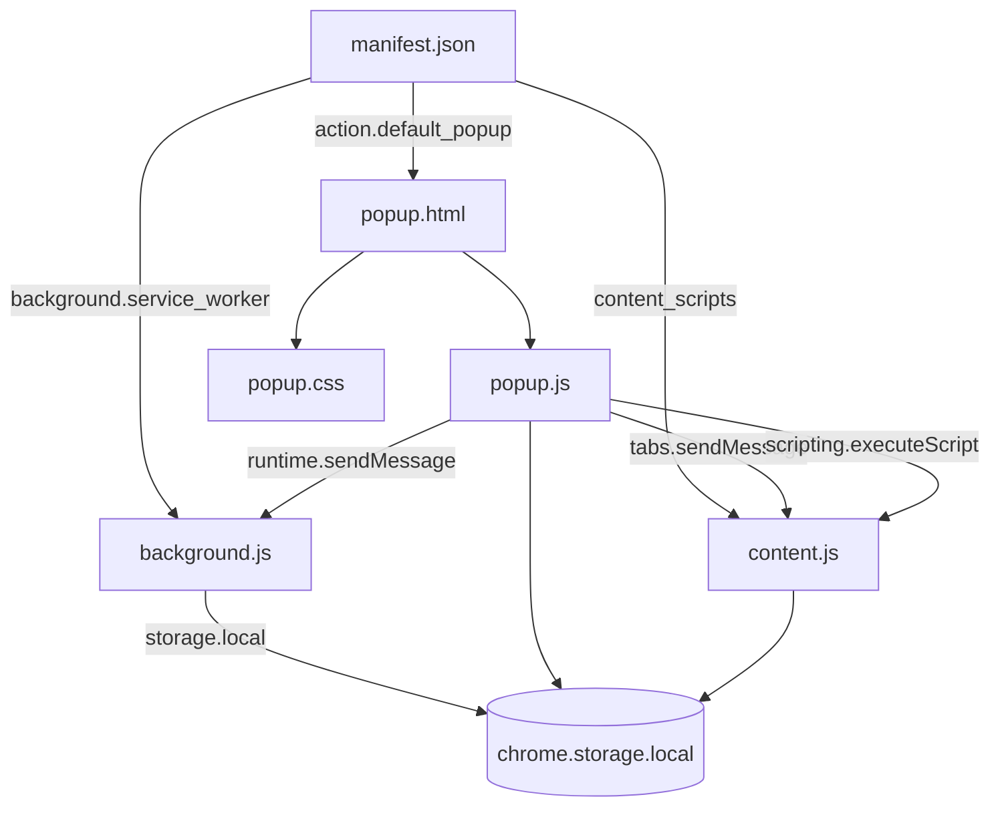

# ReachIn Project Structure

Complete folder and file reference for the ReachIn Chrome Extension repository.

---

## Directory Tree

```
linkedin/
├── .cursor/
│   └── rules/                          # Cursor AI rules (engineering standards)
│       ├── chrome-extension-architecture.mdc
│       ├── chrome-api-usage.mdc
│       ├── content-script.mdc
│       ├── javascript-standards.mdc
│       ├── privacy.mdc
│       ├── security.mdc
│       └── testing.mdc
├── assets/
│   ├── css/
│   │   └── popup.css                   # Popup styling, themes, layout
│   ├── icons/                          # MISSING — referenced by manifest
│   │   ├── icon-16.png                 # (not in repository)
│   │   ├── icon-32.png
│   │   ├── icon-48.png
│   │   └── icon-128.png
│   └── js/
│       ├── background.js               # MV3 service worker
│       ├── content.js                  # LinkedIn content script
│       └── popup.js                    # Popup UI logic
├── docs/                               # Engineering knowledge base
│   ├── README.md                       # Documentation index
│   ├── ARCHITECTURE.md
│   ├── BUSINESS_LOGIC.md
│   ├── CODE_GUIDELINES.md
│   ├── CONTENT_SCRIPT.md
│   ├── COVERAGE_REPORT.md
│   ├── LOCAL_DEVELOPMENT.md
│   ├── MANIFEST.md
│   ├── OPERATIONS.md
│   ├── PRIVACY_AND_SECURITY.md
│   ├── PROJECT_STRUCTURE.md            # This file
│   ├── STORAGE.md
│   ├── TECHNICAL_DEBT.md
│   └── UI_AND_UX.md
├── .gitignore
├── LICENSE                             # MIT License
├── manifest.json                       # Chrome Extension manifest (MV3)
├── popup.html                          # Popup UI shell
├── PRIVACY.md                          # User-facing privacy policy
└── README.md                           # User-facing project overview
```

---

## File Purposes

### Root Files

| File | Purpose |
|------|---------|
| `manifest.json` | Extension metadata, permissions, entry points, content script registration |
| `popup.html` | HTML structure for popup (main, history, settings views) |
| `README.md` | User-facing overview, features, installation, permissions summary |
| `PRIVACY.md` | Privacy policy for users and Chrome Web Store |
| `LICENSE` | MIT license |
| `.gitignore` | Excludes OS files, IDE configs, build artifacts, `.env` |

### `assets/js/`

| File | Lines | Purpose |
|------|-------|---------|
| `popup.js` | ~803 | Popup controller: UI, collection orchestration, history, settings, clipboard |
| `content.js` | ~257 | LinkedIn DOM: scroll, expand, extract emails, search input update |
| `background.js` | ~166 | Service worker: install defaults, tab lifecycle, popup auto-open |

### `assets/css/`

| File | Lines | Purpose |
|------|-------|---------|
| `popup.css` | ~591 | CSS variables for light/dark themes, popup layout, history/settings styles |

### `assets/icons/` (Missing)

Referenced in `manifest.json` for toolbar and store icons. Required for Chrome Web Store submission. See [`TECHNICAL_DEBT.md`](TECHNICAL_DEBT.md).

---

## Module Relationships



### Dependency Summary

| Module | Depends On | Depended On By |
|--------|------------|----------------|
| `manifest.json` | — | Chrome runtime |
| `popup.html` | `popup.css`, `popup.js` | Chrome action popup |
| `popup.js` | `popup.html` DOM, Chrome APIs | User |
| `content.js` | LinkedIn DOM, Chrome APIs | `popup.js` (messages), manifest (auto-inject) |
| `background.js` | Chrome APIs | `popup.js` (messages), Chrome lifecycle |
| `popup.css` | — | `popup.html` |

---

## Directory Responsibilities

### `/` (Root)

Extension package root. Loaded as unpacked extension directory in Chrome. Contains manifest and popup entry point.

### `/assets/js/`

All executable JavaScript. Three isolated execution contexts:

- **Popup context** — runs when popup opens, destroyed when popup closes
- **Content script context** — runs in LinkedIn page, shares DOM but isolated JS scope
- **Service worker context** — event-driven, may be terminated by Chrome between events

### `/assets/css/`

Presentation layer for popup only. Content script does not inject styles into LinkedIn pages.

### `/assets/icons/`

Extension branding icons. Expected but not present in repository.

### `/docs/`

Engineering knowledge base. Not loaded by the extension at runtime.

### `/.cursor/rules/`

Cursor AI guidance rules. Not loaded by the extension at runtime.

---

## Execution Context Boundaries

| Context | Can Access DOM | Can Access chrome.* | Network |
|---------|---------------|---------------------|---------|
| Popup | Popup HTML only | Yes (tabs, storage, scripting, runtime) | No |
| Content script | LinkedIn page DOM | Yes (storage, runtime) | No |
| Service worker | No DOM | Yes (storage, tabs, action, runtime) | No |

Cross-context communication uses `chrome.runtime.sendMessage` and `chrome.tabs.sendMessage` only.

---

## Build and Packaging

ReachIn has **no build step**. Source files are loaded directly by Chrome.

For Chrome Web Store submission:
1. Ensure icon assets exist under `assets/icons/`
2. Zip the extension directory (exclude `.git`, `docs/`, `.cursor/`)
3. Upload to Chrome Developer Dashboard

---

## Related Documentation

- [Architecture](ARCHITECTURE.md)
- [Manifest Reference](MANIFEST.md)
- [Local Development](LOCAL_DEVELOPMENT.md)
