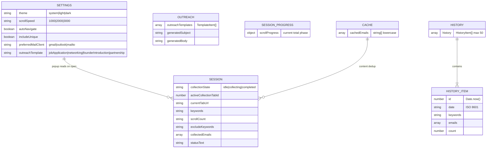
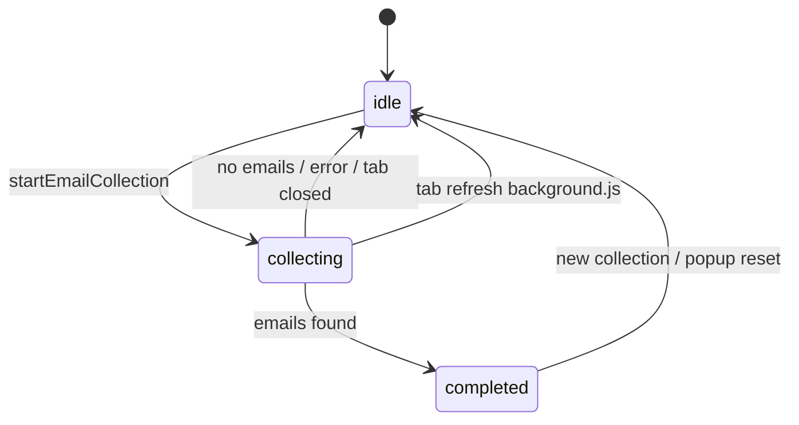
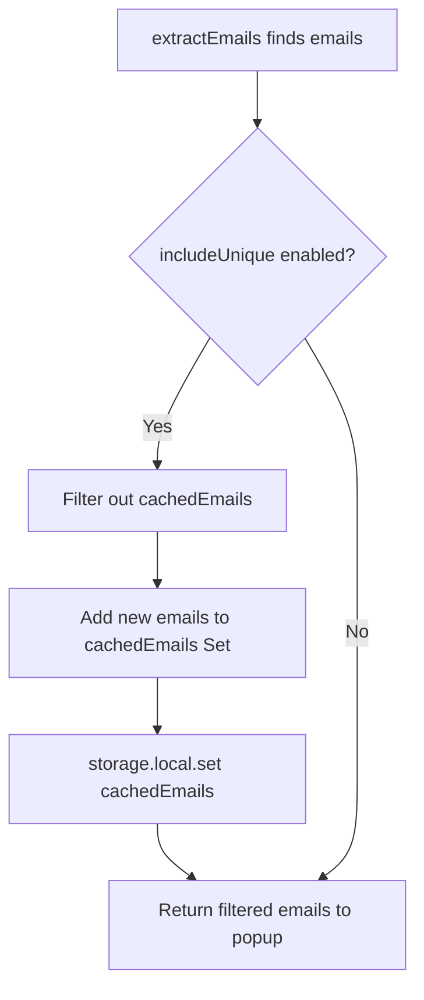

# ReachIn Storage Design

Reference for all `chrome.storage.local` usage in ReachIn.

---

## Overview

ReachIn uses a single storage namespace: **`chrome.storage.local`**.

- No `chrome.storage.sync`
- No IndexedDB, localStorage, or cookies
- Quota: ~10 MB per extension (Chrome default)
- Usage displayed in Settings via `chrome.storage.local.getBytesInUse`

All modules read/write storage directly. There is no storage abstraction layer.

---

## Schema Diagram



---

## Storage Keys

### Settings Keys

#### `theme`

| Property | Value |
|----------|-------|
| **Type** | `string` |
| **Values** | `"system"`, `"light"`, `"dark"` |
| **Default** | `"system"` (set on install by `background.js:12`) |
| **Written by** | `popup.js` (theme select change), `background.js` (install default) |
| **Read by** | `popup.js` → `loadSettings()`, `applyTheme()` |
| **Lifecycle** | Persistent until cleared |
| **Retention** | Indefinite |

Applied via `document.body.setAttribute("data-theme", ...)` and CSS variables in `popup.css`.

#### `scrollSpeed`

| Property | Value |
|----------|-------|
| **Type** | `string` |
| **Values** | `"1000"`, `"2000"`, `"3000"` (milliseconds) |
| **Default** | `"2000"` (set on install by `background.js:15`) |
| **Written by** | `popup.js` (settings select), `background.js` (install default) |
| **Read by** | `popup.js` → passed to content script as `scrollSpeed` in `collectEmails` message |
| **Lifecycle** | Persistent |
| **Retention** | Indefinite |

Controls interval between scroll steps in `content.js:scrollAndExtract()`.

#### `autoNavigate`

| Property | Value |
|----------|-------|
| **Type** | `boolean` |
| **Default** | `true` (set on install by `background.js:18`) |
| **Written by** | `popup.js` (settings checkbox), `background.js` (install default) |
| **Read by** | `popup.js` → `handleCollect()` navigation decisions |
| **Lifecycle** | Persistent |
| **Retention** | Indefinite |

When `false`, user must manually navigate to LinkedIn search before collecting.

#### `includeUnique`

| Property | Value |
|----------|-------|
| **Type** | `boolean` |
| **Default** | `true` (set on install by `background.js`) |
| **Written by** | `popup.js` (Settings → Collection checkbox), `background.js` (install default) |
| **Read by** | `popup.js` → `loadSettings()`, `loadState()`, passed to `collectEmails` message |
| **Lifecycle** | Persistent |
| **Retention** | Indefinite |

When enabled, cross-session deduplication uses `cachedEmails`. UI control is in Settings → Collection group.

#### `preferredMailClient`

| Property | Value |
|----------|-------|
| **Type** | `string` |
| **Values** | `"gmail"`, `"outlook"`, `"mailto"` |
| **Default** | `"gmail"` (set on install by `background.js`) |
| **Written by** | `popup.js` (Settings → Outreach dropdown), `background.js` (install default) |
| **Read by** | `popup.js` → `openMailDraft()` via `buildMailDraftUrl()` |
| **Lifecycle** | Persistent |
| **Retention** | Indefinite |

Controls which compose URL is opened when user clicks **Open Draft**.

#### `outreachTemplate`

| Property | Value |
|----------|-------|
| **Type** | `string` |
| **Values** | `"jobApplication"`, `"networking"`, `"founderIntroduction"`, `"partnership"` |
| **Default** | `"jobApplication"` (set on install by `background.js`) |
| **Written by** | `popup.js` (template select change), `background.js` (install default) |
| **Read by** | `popup.js` → `loadState()` |
| **Lifecycle** | Persistent until cleared |
| **Retention** | Indefinite |

---

### Outreach Keys

#### `outreachTemplates`

| Property | Value |
|----------|-------|
| **Type** | `TemplateItem[]` |
| **Default** | Seeded from `DEFAULT_OUTREACH_TEMPLATES` in `outreach-templates.js` on install |
| **Written by** | `popup.js` (settings CRUD), `background.js` (install seed) |
| **Read by** | `popup.js` |
| **Lifecycle** | Persistent until cleared |
| **Retention** | Indefinite |

**TemplateItem schema:**

```typescript
interface TemplateItem {
  id: string;
  name: string;
  subject: string;
  body: string;
  builtIn: boolean;
}
```

#### `generatedSubject`

| Property | Value |
|----------|-------|
| **Type** | `string` |
| **Default** | `""` |
| **Written by** | `popup.js` → `applySelectedTemplate()`, `saveOutreachEdits()` |
| **Read by** | `popup.js` → `loadState()` |
| **Lifecycle** | Persistent; updated on template change and manual edit |
| **Retention** | Until cleared or overwritten |

#### `generatedBody`

| Property | Value |
|----------|-------|
| **Type** | `string` |
| **Default** | `""` |
| **Written by** | `popup.js` → `applySelectedTemplate()`, `saveOutreachEdits()` |
| **Read by** | `popup.js` → `loadState()` |
| **Lifecycle** | Persistent; updated on template change and manual edit |
| **Retention** | Until cleared or overwritten |

Template defaults are seeded from `assets/js/outreach-templates.js` (`DEFAULT_OUTREACH_TEMPLATES`). User edits persist in `outreachTemplates`. No network fetch.

#### `scrollProgress`

| Property | Value |
|----------|-------|
| **Type** | `{ current: number, total: number, phase: "scrolling" \| "extracting" }` |
| **Written by** | `content.js` during collection |
| **Read by** | `popup.js` (progress bar UI) |
| **Lifecycle** | Transient during collection; removed on completion |
| **Retention** | Cleared when extraction finishes or errors |

---

### Session Keys

#### `collectionState`

| Property | Value |
|----------|-------|
| **Type** | `string` |
| **Values** | `"idle"`, `"collecting"`, `"completed"` |
| **Default** | `"idle"` |
| **Written by** | `popup.js`, `background.js` |
| **Read by** | `popup.js` (button state), `background.js` (tab lifecycle) |
| **Lifecycle** | Transient during collection; reset on tab close/refresh |
| **Retention** | Until next collection or cleanup |

State transitions:



#### `activeCollectionTabId`

| Property | Value |
|----------|-------|
| **Type** | `number \| null` |
| **Default** | `null` |
| **Written by** | `popup.js`, `background.js` |
| **Read by** | `popup.js` (show results only on matching tab), `background.js` (cleanup) |
| **Lifecycle** | Set at collection start; cleared on completion/error/tab close |
| **Retention** | Transient |

#### `currentTabUrl`

| Property | Value |
|----------|-------|
| **Type** | `string` |
| **Written by** | `popup.js` (`checkCurrentTab`, tab update listener), `background.js` (tab complete) |
| **Read by** | `background.js` only |
| **Lifecycle** | Updated on every active tab navigation |
| **Retention** | Overwritten on each update |

#### `keywords`

| Property | Value |
|----------|-------|
| **Type** | `string` (raw comma-separated input) |
| **Written by** | `popup.js` → `handleCollect()` |
| **Read by** | `popup.js` → `loadState()` |
| **Lifecycle** | Updated on each collect attempt |
| **Retention** | Until next collect or clear |

#### `scrollCount`

| Property | Value |
|----------|-------|
| **Type** | `string` or `number` |
| **Default** | `"20"` (HTML input default) |
| **Written by** | `popup.js` → `handleCollect()` |
| **Read by** | `popup.js` → `loadState()` |
| **Lifecycle** | Updated on each collect attempt |
| **Retention** | Until next collect or clear |

#### `excludeKeywords`

| Property | Value |
|----------|-------|
| **Type** | `string` (comma-separated) |
| **Written by** | `popup.js` → `handleCollect()` |
| **Read by** | `popup.js` → `loadState()`; parsed and sent to content script |
| **Lifecycle** | Updated on each collect attempt |
| **Retention** | Until next collect or clear |

#### `collectedEmails`

| Property | Value |
|----------|-------|
| **Type** | `string[]` (lowercase emails) |
| **Written by** | `popup.js` (on collection success; cleared on new collection) |
| **Read by** | `popup.js` → `loadState()` (only if `activeCollectionTabId` matches) |
| **Lifecycle** | Session-scoped to collection tab |
| **Retention** | Until new collection or clear |

#### `statusText`

| Property | Value |
|----------|-------|
| **Type** | `string` |
| **Written by** | `popup.js` → `resetStateOnOpen()` (cleared to `""`) |
| **Read by** | Never read from storage |
| **Lifecycle** | Write-only artifact |
| **Retention** | N/A |

**Known gap:** Status is managed in DOM only via `updateStatus()`. Storage write is dead code.

---

### Cache Keys

#### `cachedEmails`

| Property | Value |
|----------|-------|
| **Type** | `string[]` (lowercase emails) |
| **Default** | `[]` |
| **Written by** | `content.js` (after extraction when `includeUnique` is true) |
| **Read by** | `content.js` (on init and during dedup) |
| **Removed by** | `content.js` → `clearCache` message (unused) |
| **Lifecycle** | Grows across sessions when unique collection is enabled |
| **Retention** | Until cleared via Settings → Clear All Data |

Uniqueness flow:



**Note:** `includeUnique` is persisted in Settings → Collection and loaded on popup open via `loadSettings()` / `loadState()`.

---

### History Keys

#### `history`

| Property | Value |
|----------|-------|
| **Type** | `HistoryItem[]` |
| **Max entries** | 50 |
| **Written by** | `popup.js` → `saveToHistory()`, `deleteHistoryItem()` |
| **Read by** | `popup.js` → `loadHistory()` |
| **Lifecycle** | Persistent across sessions |
| **Retention** | Until deleted individually or cleared via Settings |

**HistoryItem schema:**

```typescript
interface HistoryItem {
  id: number;        // Date.now() timestamp
  date: string;      // ISO 8601 datetime
  keywords: string;  // Raw comma-separated keywords
  emails: string[];  // Collected email addresses
  count: number;     // emails.length
}
```

Example from `popup.js:616-622`:

```javascript
const historyItem = {
  id: Date.now(),
  date: new Date().toISOString(),
  keywords: keywords,
  emails: emails,
  count: emails.length,
};
```

New entries are prepended (`history.unshift`). When length exceeds 50, `history.splice(50)` truncates.

---

## Clear All Data

Settings → **Clear All Data** calls `chrome.storage.local.clear()` in `popup.js:167`.

This removes **all keys** including settings, history, cache, and session state. Defaults are not re-applied until extension reinstall or manual reconfiguration.

---

## Storage Access by Module

| Key | background.js | popup.js | content.js |
|-----|:---:|:---:|:---:|
| `theme` | W (default) | R/W | — |
| `scrollSpeed` | W (default) | R/W | — (via message) |
| `autoNavigate` | W (default) | R/W | — |
| `includeUnique` | W (default) | R/W | — (via message) |
| `preferredMailClient` | W (default) | R/W | — |
| `outreachTemplate` | W (default) | R/W | — |
| `outreachTemplates` | W (seed) | R/W | — |
| `generatedSubject` | — | R/W | — |
| `generatedBody` | — | R/W | — |
| `scrollProgress` | — | R | W |
| `cachedEmails` | — | — | R/W |
| `keywords` | — | R/W | — |
| `scrollCount` | — | R/W | — |
| `excludeKeywords` | — | R/W | — |
| `collectionState` | R/W | R/W | — |
| `collectedEmails` | — | R/W | — |
| `activeCollectionTabId` | R/W | R/W | — |
| `currentTabUrl` | W | W | — |
| `history` | — | R/W | — |
| `statusText` | — | W | — |

---

## Related Documentation

- [Architecture](ARCHITECTURE.md)
- [Business Logic](BUSINESS_LOGIC.md)
- [Operations — Storage Problems](OPERATIONS.md#storage-problems)
