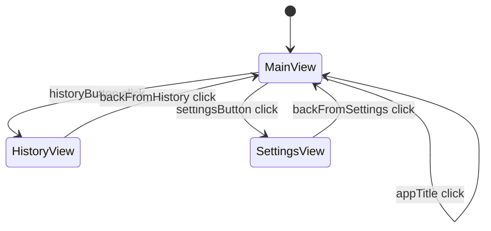
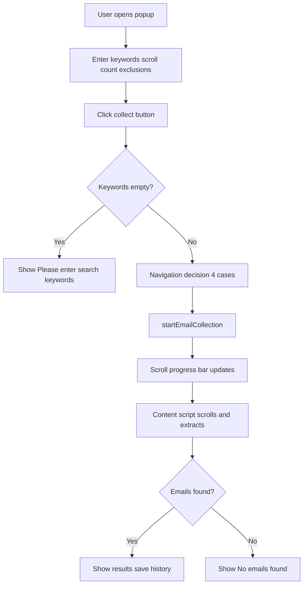
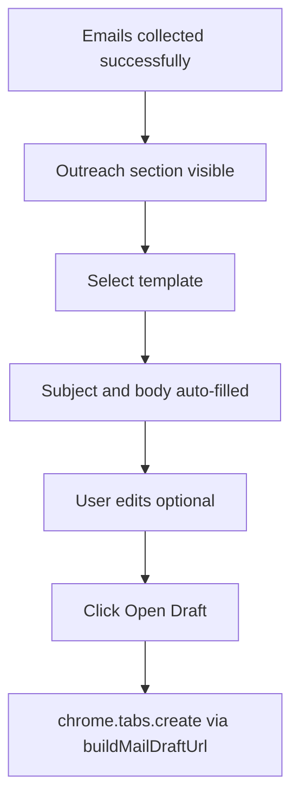

# ReachIn UI and UX

Reference for popup user interface, flows, and state management.

---

## Popup Architecture

Entry point: `popup.html` loaded via `manifest.json` → `action.default_popup`.

Dimensions: 400px wide, max 600px tall (defined in `popup.css:42-43`).

### Three-View System



| View | Element ID | Purpose |
|------|------------|---------|
| Main | `#mainView` | Search form, collect button, results, outreach |
| History | `#historyView` | Past collection records |
| Settings | `#settingsView` | Theme, speed, preferences, storage |

View switching via `switchView()` in `popup.js:735-755` toggles `.hidden` class.

---

## Main View Components

### Form Inputs

| Element ID | Type | Default | Purpose |
|------------|------|---------|---------|
| `#keywords` | text | — | Comma-separated search keywords |
| `#scrollCount` | number | 20 (min 1, max 200) | Scroll iterations |
| `#excludeKeywords` | text | — | Comma-separated email exclusion substrings |

Unique email collection (`#includeUnique`) moved to Settings → Collection group.

Keywords placeholder rotates every 3 seconds through 8 example queries when input is empty and unfocused.

### Action Buttons

| Element ID | Type | Purpose |
|------------|------|---------|
| `#collectButton` | `.btn.btn-primary` | Start collection or navigate (dynamic label) |
| `#copyButton` | `.btn.btn-icon` + copy SVG | Copy results to clipboard (toast on success) |
| `#historyButton` | `.btn.btn-icon` + history SVG | Open history view |
| `#settingsButton` | `.btn.btn-icon` + settings SVG | Open settings view |
| `#appTitle` | button | Navigate to main view (home icon + "ReachIn") |

**Collect button labels** (set by `updateButtonBasedOnUrl()`):

| Condition | Label |
|-----------|-------|
| Not on linkedin.com | "Open LinkedIn" |
| On LinkedIn but not search results | "Navigate to Search" |
| On search results page | "Collect Emails" |
| During collection | "Collecting..." (disabled) |

### Results Display

| Element ID | Purpose |
|------------|---------|
| `#statusText` | Errors and warnings only (hidden when empty) |
| `#toastContainer` | Transient success/info toasts via `showToast()` |
| `#scrollProgressContainer` | Scroll progress bar (visible during collection) |
| `#scrollProgressFill` | Progress bar fill width |
| `#scrollProgressText` | `Scrolling X/Y` or `Extracting emails...` |
| `#resultContainer` | Results panel (hidden until emails found) |
| `#emailCount` | "Found N email(s)" header |
| `#emailList` | Newline-separated email list (monospace) |

### Outreach Section

Visible when collected emails exist (same tab-scoped visibility as results). Hidden when no emails or wrong tab.

| Element ID | Type | Purpose |
|------------|------|---------|
| `#outreachContainer` | panel | Outreach section wrapper |
| `#outreachTemplate` | select | Template picker (dynamic from storage) |
| `#outreachSubject` | text | Editable email subject |
| `#outreachBody` | textarea | Editable email body |
| `#openDraftButton` | `.btn.btn-primary` | Open compose draft in preferred mail client |

Template dropdown is populated from `outreachTemplates` in storage. Changing the template auto-fills subject and body.

### Settings — Outreach Template Editor

| Element ID | Purpose |
|------------|---------|
| `#templateManageSelect` | Select template to edit |
| `#templateNameInput` | Template display name |
| `#templateSubjectInput` | Template subject |
| `#templateBodyInput` | Template body |
| `#saveTemplateButton` | Save changes (disabled until dirty) |
| `#unsavedIndicator` | Shows when template editor has unsaved changes |
| `#addTemplateButton` | Create new custom template |
| `#deleteTemplateButton` | Delete custom template (hidden for built-ins) |
| `#resetTemplateButton` | Reset built-in template to default (built-ins only) |

---

## User Flows

### Collect Emails Flow



See [`BUSINESS_LOGIC.md`](BUSINESS_LOGIC.md) for navigation decision details.

### Copy Flow

1. User clicks copy icon (`#copyButton`)
2. `handleCopy()` joins emails with `", "` separator
3. `navigator.clipboard.writeText()` writes to clipboard
4. Icon briefly swaps to checkmark; `showToast("Emails copied", "success")`

### Toast System

`showToast(message, type)` in `assets/js/ui/toast.js` displays auto-dismissing notifications.

| Type | Use |
|------|-----|
| `success` | Copy, template saved, draft opened, settings saved |
| `error` | Rare; most errors use `#statusText` |
| `info` / `warning` | Informational |

Toast icons use the centralized SVG library (`assets/js/ui/icons.js`).

### SVG Icon System

All action affordances use SVG icons from `icons.js` — no emoji. Icons use `stroke="currentColor"` for automatic theme inheritance.

Helpers: `renderIcon(name)`, `createIconButton(name, { label })`, `setButtonIcon(button, name)`.

Every icon-only button requires `aria-label` and `title`.

### Outreach Flow



1. User collects emails — outreach section appears with template auto-applied
2. User selects a different template — subject/body update immediately
3. User may edit subject/body — persisted on input
4. User clicks **Open Draft** — opens Gmail, Outlook, or system mail app per `preferredMailClient`

**Feedback:**

| Action | Feedback |
|--------|----------|
| Template change | Subject/body updated silently |
| Open Draft clicked | Toast: "Draft opened" |
| Open Draft, no emails | Status: "Collect emails first" |
| Open Draft, no content | Status: "Subject and message are required" |

### Scroll Progress

During collection, a progress bar appears below the status text:

| Phase | Display |
|-------|---------|
| `scrolling` | `Scrolling 5/20` with fill bar |
| `extracting` | `Extracting emails...` |

Progress is written to `scrollProgress` in storage by the content script and reflected in the popup via `chrome.storage.onChanged`. Reopening the popup mid-collection restores progress from storage.

### History Flow

1. User clicks history icon → `switchView("history")`
2. `loadHistory()` reads `history` from storage
3. Each entry shows date, keywords, email count
4. Click chevron icon → expand/collapse email list (180° rotation)
5. Copy icon → clipboard copy with toast
6. Delete icon → remove entry from storage

Empty state: history icon + "No collection history yet" with subtitle.

History capped at 50 entries (oldest removed on new save).

### Settings Flow

1. User clicks settings icon → `switchView("settings")`
2. Settings loaded from storage on popup open
3. Changes saved immediately on interaction (no Save button)

Settings are organized into five card groups:

| Group | Controls | Storage Keys |
|-------|----------|--------------|
| Appearance | Theme | `theme` |
| Collection | Scroll speed, auto-navigate, unique emails | `scrollSpeed`, `autoNavigate`, `includeUnique` |
| Outreach | Mail client, default template, template editor | `preferredMailClient`, `outreachTemplate`, `outreachTemplates` |
| Storage | Usage display, clear data | — |
| About | Version, privacy link | — |

| Setting | Control | Storage Key |
|---------|---------|-------------|
| Theme | `#themeSelect` dropdown | `theme` |
| Scroll speed | `#scrollSpeedSelect` dropdown | `scrollSpeed` |
| Auto-navigate | `#autoNavigate` checkbox | `autoNavigate` |
| Unique emails | `#includeUnique` checkbox | `includeUnique` |
| Default mail client | `#preferredMailClient` dropdown | `preferredMailClient` |
| Default template | `#defaultTemplateSelect` dropdown | `outreachTemplate` |
| Clear all data | `#clearStorageButton` | clears all keys |
| Storage usage | `#storageUsage` (read-only) | `getBytesInUse` |

Changes save immediately on interaction. Success feedback via toast.

**Clear All Data:** Confirmation dialog → `chrome.storage.local.clear()` → reload history and recalculate usage.

---

## Settings

### Theme Management

Three theme modes via `#themeSelect`:

| Value | Behavior |
|-------|----------|
| `system` | Uses `window.matchMedia("(prefers-color-scheme: dark)")` |
| `light` | Sets `data-theme="light"` on body |
| `dark` | Sets `data-theme="dark"` on body |

Implementation in `applyTheme()`:

```127:134:assets/js/popup.js
  function applyTheme(theme) {
    if (theme === "system") {
      const isDark = window.matchMedia("(prefers-color-scheme: dark)").matches;
      document.body.setAttribute("data-theme", isDark ? "dark" : "light");
    } else {
      document.body.setAttribute("data-theme", theme);
    }
  }
```

CSS variables defined in `popup.css`:

```2:32:assets/css/popup.css
:root {
  --bg-primary: #ffffff;
  ...
}

[data-theme="dark"] {
  --bg-primary: #1a1a1a;
  ...
}
```

Theme is applied on popup open and on select change. No listener for system theme changes while popup is open.

### Auto-Navigate

When enabled (default), clicking Collect automatically:
- Opens LinkedIn in a new tab (if not on LinkedIn)
- Navigates to content search page (if on LinkedIn but wrong page)
- Updates search input or navigates (if keywords don't match)

When disabled, status messages instruct user to navigate manually.

### Show Notifications

Checkbox exists and persists to storage but **has no effect on UI behavior**. Status messages always display in `#statusText` regardless of this setting.

---

## History View

### History Item Structure

Each item rendered by `createHistoryItem()`:

```
┌─────────────────────────────────────┐
│ Jan 15, 2026, 10:30 AM        [▼]  │
│ python, mumbai, hiring              │
│ 12 emails collected                 │
├─────────────────────────────────────┤
│ email1@example.com                  │  (expandable)
│ email2@example.com                  │
│              [Copy All] [Delete]    │
└─────────────────────────────────────┘
```

Date formatted with `toLocaleString("en-US", ...)`.

---

## Clipboard Features

| Action | Function | Format |
|--------|----------|--------|
| Copy current results | `handleCopy()` | Comma-separated |
| Copy from history | history copy button handler | Comma-separated |

Both use `navigator.clipboard.writeText()`. No error handling for clipboard permission denial.

---

## State Management

### In-Memory State (popup.js)

| Variable | Purpose |
|----------|---------|
| `collectedEmails` | Current collection results |
| `currentTabUrl` | Active tab URL |
| `currentTabId` | Active tab ID |
| `placeholderIndex` | Rotating placeholder counter |

### Persisted State (chrome.storage.local)

See [`STORAGE.md`](STORAGE.md) for full key reference.

### State on Popup Open

`resetStateOnOpen()` and `loadState()` run on every popup open:

1. Verify active collection tab still exists
2. Reset `collectionState` to idle if tab closed
3. Restore form fields from storage
4. Show collected emails only if on the same tab where collection occurred
5. Set button state based on collection status

### Tab Event Listeners

| Event | Handler | Effect |
|-------|---------|--------|
| `tabs.onUpdated` (complete) | Update URL, button label, clear status | Reflect navigation |
| `tabs.onActivated` | `checkCurrentTab()`, `loadState()` | Tab switch reload |

Results are tab-scoped: switching tabs hides results unless the new tab is the collection tab.

---

## CSS Architecture

Single stylesheet: `assets/css/popup.css`

| Section | Lines | Purpose |
|---------|-------|---------|
| CSS variables | 1-32 | Light/dark theme tokens |
| Base styles | 34-63 | Typography, body dimensions |
| Header | 72-107 | Title and icon buttons |
| Views | 109-146 | View containers and back buttons |
| Forms | 148-228 | Inputs, labels, checkboxes |
| Buttons | 230-284 | Primary, secondary, copy styles |
| Results | 286-324 | Email list display |
| History | 326-478 | History items and actions |
| Settings | 480-543 | Settings layout |
| Scrollbar | 545-561 | Custom scrollbar |
| Animations | 563-585 | fadeIn on results/history |
| Utilities | 587-590 | `.hidden` class |

---

## Related Documentation

- [Business Logic](BUSINESS_LOGIC.md)
- [Architecture](ARCHITECTURE.md)
- [Storage Design](STORAGE.md)
